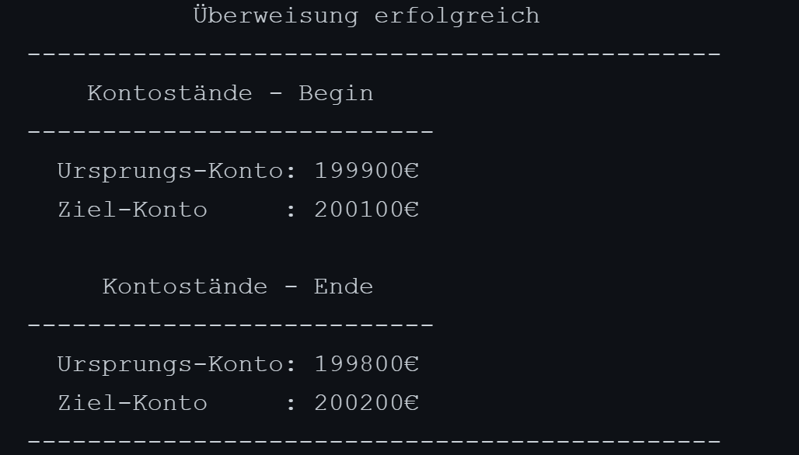

###### <p align="center"> DbiUebung-005 </p>

<div align="center">
  
  # PLSQL - `PROCEDURE` - Konto Überweisung   

  <p align="left">  $\Large\color{lime}{Stored Procedure:}$ </p>  
    
   - <p align=left">TRANSFER_MONEY( source $\color{skyblue}{in\ }\color{royalblue}{NUMBER}$, target $\color{skyblue}{in\ }\color{royalblue}{NUMBER}$, amount $\color{skyblue}{in\ }\color{royalblue}{NUMBER}$, balSource $\color{crimson}{out\ }\color{royalblue}{NUMBER}$, balTarget $\color{crimson}{out\ }\color{royalblue}{NUMBER}$ ):</p>
  
     - <p align="left"> Fertige Ausgabe: </p>

        |    Consolen Ausgabe:                               |   
        |:---------------------------------------------------|   
        | <p align="center"></p>  |   

</div>
  
  - <p align="left"> Code Snippets: </p>
  
      - ## Create Procedure:
        ```SQL
        CREATE or REPLACE PROCEDURE Transfer_Money 
        (
             source     in  NUMBER
           , target     in  NUMBER
           , amount     in  NUMBER
           , source_bal out NUMBER
           , target_bal out NUMBER
        ) 
        is 
        BEGIN  
          -------------------------------------
          SELECT balance
            INTO source_bal
            FROM konto
           WHERE kid = source;
          -------------------------------------
            IF source_bal < amount THEN
              source_bal := -1;
              target_bal := null;
            ELSE
              UPDATE konto set balance = balance - amount WHERE kid = source;
              UPDATE konto set balance = balance + amount WHERE kid = target;

              SELECT balance INTO source_bal FROM konto   WHERE kid = source;
              SELECT balance INTO target_bal FROM konto   WHERE kid = target;
            END IF;
          -------------------------------------
          END;
        ```

      - ## Procedure Aufruf:
        ```SQL
        DECLARE 
        source_bal_start NUMBER;
        target_bal_start NUMBER;
        source_bal       NUMBER;
        target_bal       NUMBER;
        BEGIN
        -------------------------------------
        SELECT balance
          INTO source_bal_start
          FROM konto
         WHERE kid = 1;
        -------------------------------------
        SELECT balance
          INTO target_bal_start
          FROM konto
         WHERE kid = 2;
        -------------------------------------
        Transfer_Money
        (
           1
         , 2
         , 100
         , source_bal
         , target_bal
        );
        -------------------------------------
          IF source_bal = -1 THEN
            dbms_output.put_line('----------------------------------------------');
            dbms_output.put_line('! Überweisung unmöglich - zu wenig Guthaben !' );
            dbms_output.put_line('----------------------------------------------');
          ELSE
            dbms_output.put_line('           Überweisung erfolgreich            ');
            dbms_output.put_line('----------------------------------------------');

            dbms_output.put_line('    Kontostände - Begin    ');
            dbms_output.put_line('---------------------------');
            dbms_output.put_line('  Ursprungs-Konto: ' || source_bal_start || '€');
            dbms_output.put_line('  Ziel-Konto     : ' || target_bal_start || '€');
            dbms_output.put_line('');

            dbms_output.put_line('     Kontostände - Ende    ');
            dbms_output.put_line('---------------------------');
            dbms_output.put_line('  Ursprungs-Konto: ' || source_bal || '€');
            dbms_output.put_line('  Ziel-Konto     : ' || target_bal || '€');
            dbms_output.put_line('----------------------------------------------');
            dbms_output.put_line('');
          END IF;
        -------------------------------------
        END;
        ```
        ---
   
        - #### Zusatzaufgabe:
          ```SQL
          ALTER TABLE konto 
            ADD CONSTRAINT valid_balance 
            CHECK( balance >= 0 );
          ```
    
